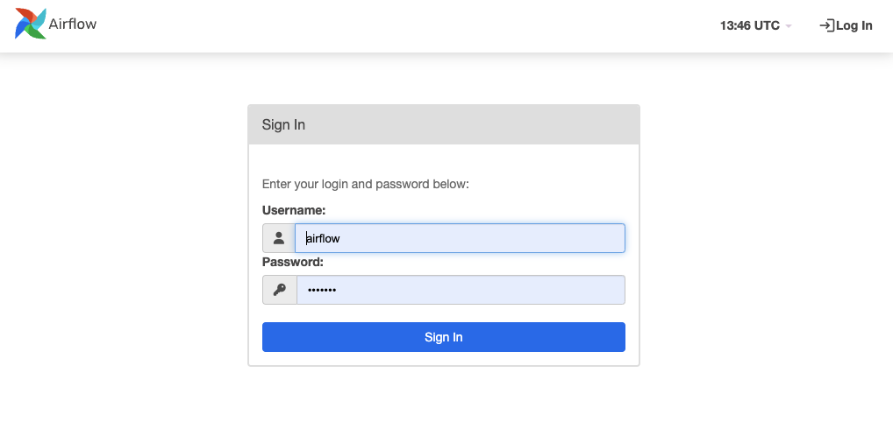
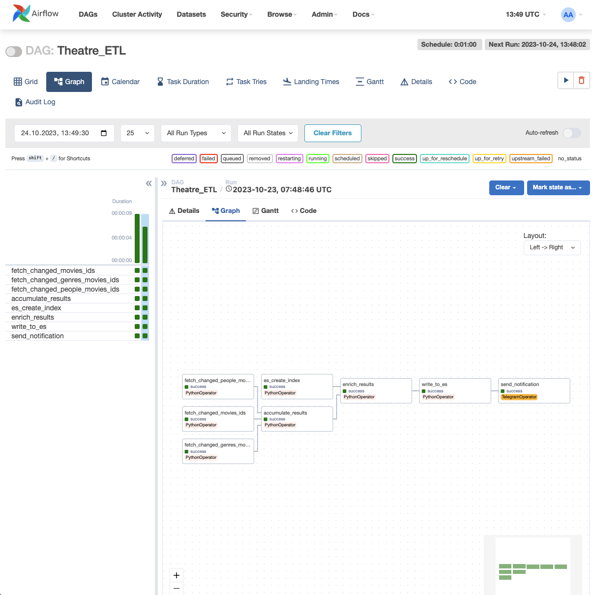
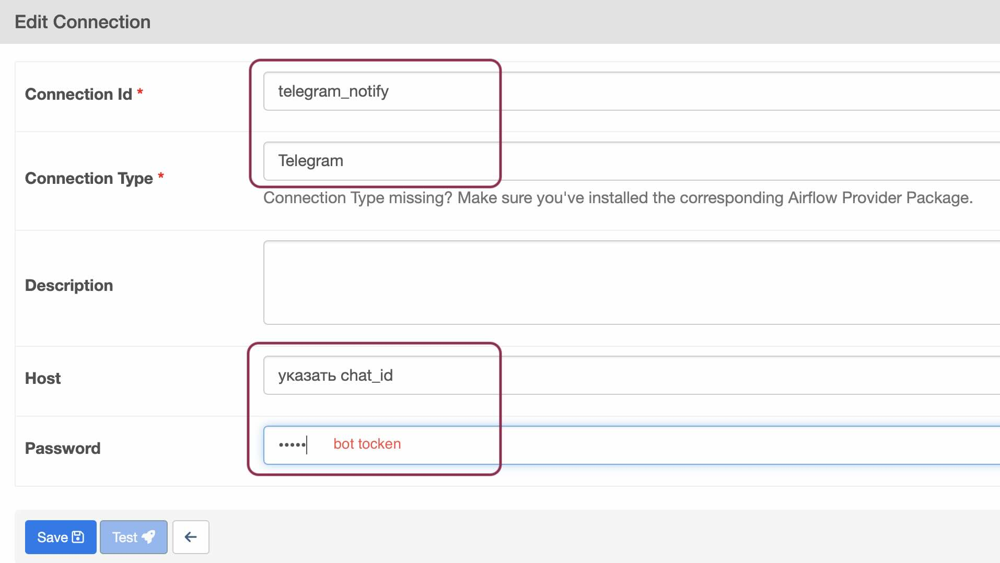

Запуск всего командой:

```bash
docker compose -f docker-compose-airflow.yaml -f docker-compose.yaml up -d
```

При запуске проекта развернутся все необходимые сервисы и в postgres будут вставлены все 999 фильмов, с людьми и жанрами.

После этого создайте суперпользователя в Django админке и запустите приложение:

```bash
cd django_admin
```
```bash
DJANGO_SUPERUSER_USERNAME=admin \
DJANGO_SUPERUSER_PASSWORD=123123 \
DJANGO_SUPERUSER_EMAIL=mail@mail.ru \
python manage.py createsuperuser --noinput || true
```
```bash
./manage.py runserver
```

Apache Airflow будет доступен по адресу http://localhost:8080/ (дефолтные значения для входа airflow/airflow)



В списке DAG-ов находим Theatre_ETL и с ним работаем.



Для работы ETL необходимо определить соединение c postgres как на изображении:


Для отправки сообщений в Telegram необходимо разеристирировать бота и определить соединение как на изображении:



### Весь код находится в `dags/test_movie_etl.py`
