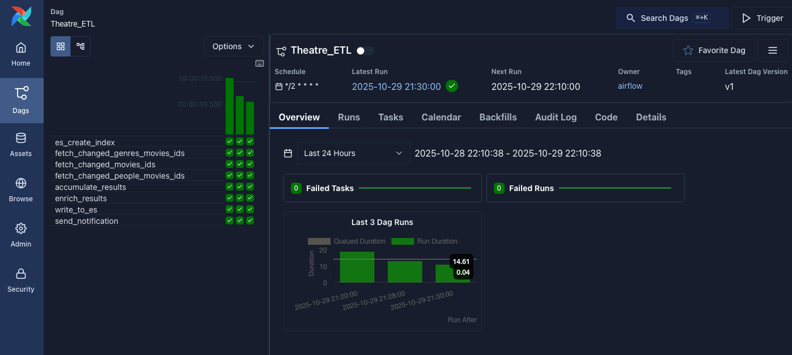
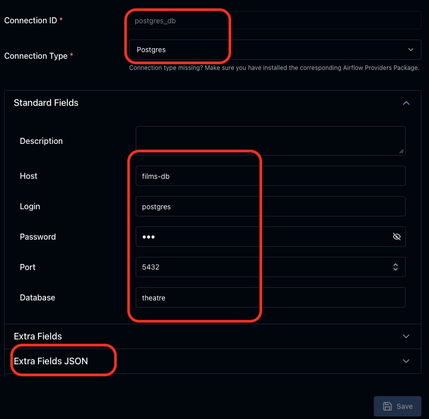
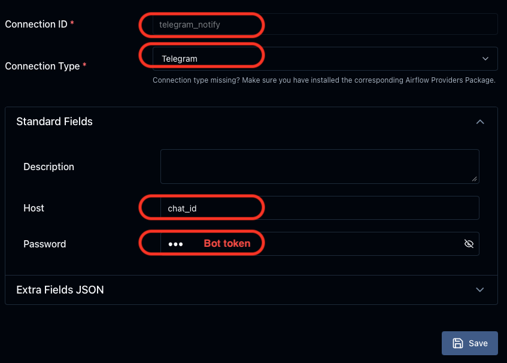

Предполагается наличие uv (https://docs.astral.sh/uv/)

### Запуск airflow + elastic + postgres + kibana:
```bash
docker compose -f docker-compose-airflow.yaml -f docker-compose.yaml up -d
```
или `make run`

### Запуск Django:
```bash
	cd ./django_admin && \
    uv sync --locked && \
	DJANGO_SUPERUSER_USERNAME=admin \
	DJANGO_SUPERUSER_PASSWORD=123123 \
	DJANGO_SUPERUSER_EMAIL=mail@mail.ru \
	uv run ./manage.py createsuperuser --noinput || true && \
	uv run ./manage.py runserver
```
или `make django`


### Доступы:
- Airflow: http://127.0.0.1:8080 логин airflow пароль airflow
- Kibana: http://127.0.0.1:5601
- Django: http://127.0.0.1:8000/admin логин admin пароль 123123

При запуске проекта развернутся все необходимые сервисы и в postgres будут вставлены все 999 фильмов, с людьми и жанрами.

В списке DAG-ов находим Theatre_ETL и с ним работаем.



Для работы ETL необходимо определить соединение c postgres как на изображении (данные подключения из .env и название контейнера из docker-compose.yml). Admin -> Connections -> Add connection



**ВАЖНО!** в настройках postgres необходимо также указать в Extra Fields JSON:
```json
{
  "cursor": "dictcursor"
}
```

Для отправки сообщений в Telegram необходимо разегистирировать бота и определить соединение как на изображении:



### Весь код находится в `dags/test_movie_etl.py`

Для работы с DAG (папка ./dags) в PyCharm/VSCode выполнить `uv sync --locked` для установки виртуального окружения с пакетами airflow.
